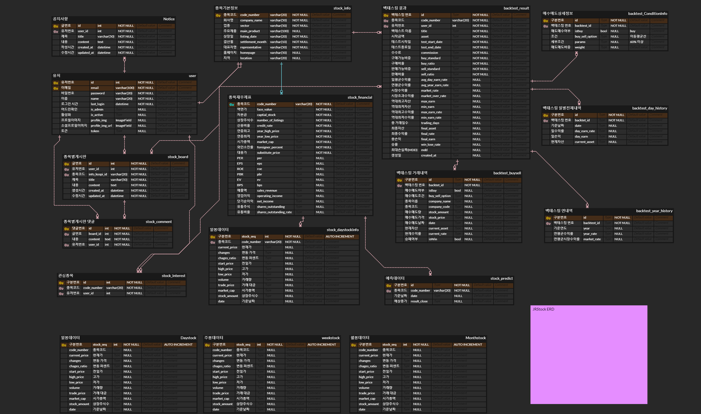

## 목차

### 1. [Introduction](#motivation)

### 2. [Main Function](#main-function)

### 3. [Technical Features](#technical-features)

### 4. [Environment](#%EF%B8%8Fdevelopment-environment)

### 5. [Project Planning](#service-architecture)

### 6. [Our Team](#our-team)

### 7. [Challenges ( Problems / Bugs )](#challenges-problems-bugs-)


## 💡**Motivation**

최근 들어 주식에 대한 관심이 급증했으며 작년 동안 유입된 신규 투자자만 400만명에 다다릅니다.<br>그리고 이들은 주식에 대한 지식과 경험이 부족했고, 대부분 투자를 실패했습니다.

이는 안정적인 주식 투자를 위한 러닝 커브는 높고, 이를 학습할 플랫폼은 부족하기 때문입니다.

그래서 저희는 주식에 입문하며, 주식에 대해 잘 모르는 소액 투자자들 일명 개미, 주린이들이 <br>안전하고 효과적으로 주식 투자를 공부할 수 있도록 매매 전략을 학습하고, 직접 구성한 전략을 테스트할 수 있는 서비스를 개발했습니다.

## 💸**Introduction**

**내 집 마련을 위해 주식은 선택이 아닌 필수!!<br>
남들 다하니까 시작했다가, 손해만 보고 그만 두신 적 없으신가요?!<br>
1000만 개미들의 염원이 담겨 탄생한 바로 그 서비스!! <br>
굶주린 주식 어린이를 위한 플랫폼 JRStock 과 함께 주식 투자 전문가로 성장해보세요!**

🔹**JRStock**은 국내 주식 기반 백테스트 플랫폼입니다.<br> **JRStock**은 주린이를 대상으로 서비스를 구성하여 누구나 쉽게 매매 전략을 구성하고, 테스트해볼 수 있으며, 결과를 분석할 수 있습니다. <br>또한 종목 토론방을 통해 지식을 공유하거나, 랭킹을 통해 다른 사람과 전략을 경쟁, 공유하며 성공적인 주식투자로 이끌 수 있습니다.

## 💻 **Project Period - [2021.02.21 ~ 2021.04.08]**

## 👀 **jrstock service demo**

### 백테스트 생성


### 백테스트 결과


### 주식 종목 필터링


### 랭킹


### App 백테스트 생성


### App 알림 및 결과


## 💡**Main Function**

### 회원 관리

- 이메일 인증을 통한 회원 활성화
- 구글 소셜 로그인
- 회원 정보 및 프로필 이미지 수정

### 주식 데이터

- 주식 데이터 라인차트 및 캔들차트 제공
- 주식 실시간 데이터 제공
- 백테스트를 위한 자료 누적
- 일일 거래 데이터 자동 수집 스케쥴링

### 백테스트

- 종목 단위 백테스트 실행
- 다양한 백테스트 전략 및 변수 커스터마이징 제공
- 상세 거래 내역, 자산 운용 차트 등 결과 제공

### 종목 필터링

- 주식 종목 검색
- 종목 지표별 필터링 기능

### 종가 예측 서비스

- 주요 종목 머신러닝&딥러닝 기반 오늘의 종가 예측 데이터 제공

### 게시판

- 종목별 토론 게시판 제공
- 공지사항
- 종목 시황 정보 제공

### 랭킹

- 일간, 주간, 월간 수익율 기준 전체 순위 정보 제공
- 이름 검색을 통해 원하는 사용자 랭킹 정보를 제공

## 💪**Technical Features**

### 주가 예측

주가 예측 서비스는 이전 주가 데이터를 통해 다음 주가를 예측하여 제공하는 서비스입니다.<br>
주가 예측 서비스에는 딥러닝 기술 RNN이 적용 됐습니다.<br>
기존 신경망 알고리즘은 데이터 맥락을 학습시킬 수 없었기 때문에 순환 신경망 알고리즘을 사용하게 됐습니다.<br> 아래 예시에서 주가 추세를 상당히 정확하게 예측하고 있습니다.


### 백테스팅 빅데이터

약 2500개 주식에 대한 상장 이후 모든 일일 거래 데이터를 사용하고 있습니다. 또한 매일 스케쥴링을 통해 최신 데이터를 자동으로 수집하고 있습니다.


### 데이터 시각화

백테스트 결과를 한 눈에 알아보기 편하도록 차트를 사용하여 데이터를 시각화 하였습니다.


## ⚙️**Development Environment**

### Backend

- Django
- Gunicorn
- MySql
- Celery
- Redis

### Frontend

- React
- React Router v6
- react-google-login
- Tailwind CSS
- lightweight-charts
- etc
  - axios
  - chart.js / react-chartjs-2
  - react-awesome-reveal
  - react-datepicker
  - react-toastify
  - react-tooltip
  - headlessui / heroicons

### Database/Machine Learning

- MySql
- Kiwoom open API+
- Pandas
- Pandas-datareader
- Tensorflow
- Google Colaboratory

### Android

- Android Studio Bumblebee
- Firebase Cloud Messaging

### 배포

- AWS
- Docker
- NGINX
- Jenkins (CI/CD)
- Git

### 기타

- Google Docs
- Google Analytics
- Google Cloud Platform(OAuth)

## 🔨**Collaboration Tools**

- Gitlab
- Jira
- Notion
- Mattermost
- Discord
- Slack
- Figma
- ERDCloud

## 💫Service Architecture


## 📜**Functional Specification**

[JRStock 기능명세서.pdf](README_assets/JRStock_%EA%B8%B0%EB%8A%A5%EB%AA%85%EC%84%B8%EC%84%9C.pdf)

## 🖼️**Figma Wireframe**


## 🔗**ERD**



## 👨‍💻**Our Team**


## 🐞**Challenges ( Problems / Bugs )**

### BE

---

- Django를 처음 활용해서 배우고 활용하는데 어려움이 있었습니다.
- 테이블을 Join 하거나 다루는 부분에서 Django ORM이 적응이 어려웠습니다.
- 배포 이후 유저들이 생각하지 못한 값들을 보내서 해당 내용을 다 처리하고 DB의 크기를 늘리는데 유저들은 우리 생각대로 움직여 주지 않는 다는 것을 느꼈습니다

### FE

---

- React가 익숙치 않아 페이지 구성 시 어떤 기준으로 컴포넌트 화를 해야할지 판단하기가 어려웠습니다.
- 페이지가 렌더된 후 State의 상태를 관리하는 것이 어려워서 원하는 데이터를 내려주거나 페이지에 렌더하는 것이 어려웠습니다.

- useEffect Hook 내에서 비동기 함수 사용과, React 컴포넌트의 생명주기를 고려한 개발이 어려웠고, 깊게 공부할수록 개선해야 할 사항이 많이 보여 어려웠습니다.
  ```jsx
  Warning: Can't perform a React state update on an unmounted component.
  This is a no-op, but it indicates a memory leak in your application.
  To fix, cancel all subscriptions and asynchronous tasks in a useEffect cleanup
  ```
- 빠른 기능 구현을 목표로 개발하다보니, 코드 품질에 많은 신경을 기울이지 못하여 아쉬웠습니다. (추후에 코드 중복 제거나, 효율적인 동작 방식에 대한 고민이 더 필요할 것 같습니다. )
- 백엔드와 주고 받는 데이터의 종류와 양이 많다보니, JavaScript 특성 상 변수의 타입 관리가 안되는 점이 매우 불편하게 다가왔습니다. 다음 프로젝트에는 꼭 TypeScript 를 사용해야겠습니다..

### Data

---

- Trading 전략을 커스터마이징할 수 있도록 모듈화하는 것이 어려웠습니다.
- 수십년간 데이터를 수집하고 필요한 지표로 변환하는 과정에서 많은 시간이 소요됐습니다.
- 딥러닝을 하면서 최대한 유사한 근삿값을 도출하는데 어려움이 있었습니다.

### 기타

---

- Jenkins의 BuildTrigger을 구성하는데 어려움이 있었습니다.(Jenkins↔Gitlab)
